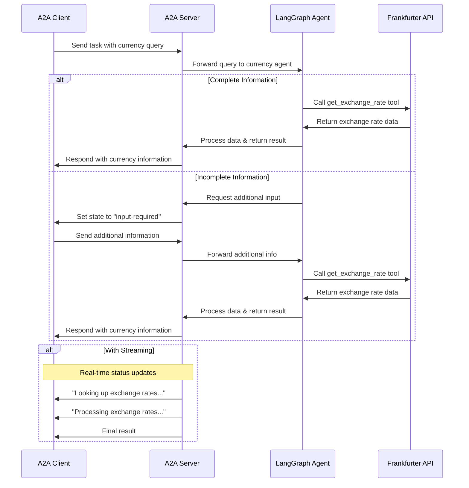

# A2A Agentic RAG

An LangGraph RAG Agent served using A2A protocol

## How It Works



## Setup

1. Create an environment file following `.env.sample`

2. Optionally pull the required models

```
ollama pull llama3.2:3b
ollama pull all-minilm:33m
```

3. Start ollama

```
ollama serve
```

## Running

1. Start the A2A Server:

   ```bash
   # Basic run on default port 10000
   uv run start_a2a_server.py

   # On custom host/port
   uv run start_a2a_server.py --host 0.0.0.0 --port 8080
   ```

2. In a separate terminal, start the Streamlit UI:

   ```bash
   streamlit run streamlit_ui.py
   ```

## Examples

**Synchronous request**

Request:

```
curl -X POST http://localhost:10000/ \
 -H "Content-Type: application/json" \
 -d '{
  "id": "6d12d159-ec67-46e6-8d43-18480ce7f6ca",
  "jsonrpc": "2.0",
  "method": "message/send",
  "params": {
    "message": {
      "kind": "message",
      "messageId": "2f9538ef0984471aa0d5179ce3c67a28",
      "parts": [
        {
          "kind": "text",
          "text": "What is the revenue of software group?"
        }
      ],
      "role": "user"
    }
  }
}'
```

**Streaming Request**

Request:

```
curl -X POST http://localhost:10000/ \
 -H "Content-Type: application/json" \
 -d '{
  "id": "6d12d159-ec67-46e6-8d43-18480ce7f6ca",
  "jsonrpc": "2.0",
  "method": "message/stream",
  "params": {
    "message": {
      "kind": "message",
      "messageId": "2f9538ef0984471aa0d5179ce3c67a28",
      "parts": [
        {
          "kind": "text",
          "text": "What is the revenue of software group?"
        }
      ],
      "role": "user"
    }
  }
}'
```
